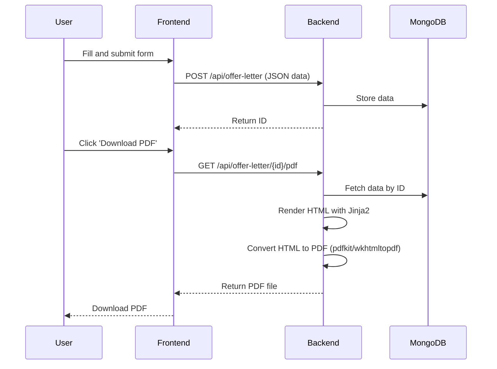

# Welcome to your Lovable project

## Project info

**URL**: https://lovable.dev/projects/79916802-bfc7-4d87-86a4-61efca680b13

## How can I edit this code?

There are several ways of editing your application.

**Use Lovable**

Simply visit the [Lovable Project](https://lovable.dev/projects/79916802-bfc7-4d87-86a4-61efca680b13) and start prompting.

Changes made via Lovable will be committed automatically to this repo.

**Use your preferred IDE**

If you want to work locally using your own IDE, you can clone this repo and push changes. Pushed changes will also be reflected in Lovable.

The only requirement is having Node.js & npm installed - [install with nvm](https://github.com/nvm-sh/nvm#installing-and-updating)

Follow these steps:

```sh
# Step 1: Clone the repository using the project's Git URL.
git clone <YOUR_GIT_URL>

# Step 2: Navigate to the project directory.
cd <YOUR_PROJECT_NAME>

# Step 3: Install the necessary dependencies.
npm i

# Step 4: Start the development server with auto-reloading and an instant preview.
npm run dev
```

**Edit a file directly in GitHub**

- Navigate to the desired file(s).
- Click the "Edit" button (pencil icon) at the top right of the file view.
- Make your changes and commit the changes.

**Use GitHub Codespaces**

- Navigate to the main page of your repository.
- Click on the "Code" button (green button) near the top right.
- Select the "Codespaces" tab.
- Click on "New codespace" to launch a new Codespace environment.
- Edit files directly within the Codespace and commit and push your changes once you're done.

## What technologies are used for this project?

This project is built with:

- Vite
- TypeScript
- React
- shadcn-ui
- Tailwind CSS

## How can I deploy this project?

Simply open [Lovable](https://lovable.dev/projects/79916802-bfc7-4d87-86a4-61efca680b13) and click on Share -> Publish.

## Can I connect a custom domain to my Lovable project?

Yes, you can!

To connect a domain, navigate to Project > Settings > Domains and click Connect Domain.

Read more here: [Setting up a custom domain](https://docs.lovable.dev/tips-tricks/custom-domain#step-by-step-guide)

---

Here’s a plan to build a Python backend for your Vite/React/TypeScript/shadcn-ui/Tailwind CSS project, which will:

- Receive form data from the frontend and store it in a NoSQL database (JSON format).
- Provide endpoints to generate DOCX and PDF files from the stored data.
- Integrate cleanly with your existing frontend (no changes required on the frontend).

---

## 1. **Tech Stack Selection**

- **Backend Framework:** FastAPI (modern, async, great for JSON APIs, easy to use with Pydantic for data validation)
- **NoSQL Database:** MongoDB (native JSON support, easy integration with Python via `motor` or `pymongo`)
- **DOCX Generation:** `python-docx`
- **PDF Generation:** `reportlab` or `pdfkit` (for HTML-to-PDF, can use `jinja2` for templating)
- **Other:** `uvicorn` for running FastAPI, `pydantic` for data validation

---

## 2. **Backend API Design**

### Endpoints

- `POST /api/offer-letter`  
  Receives form data (JSON), stores in MongoDB, returns a unique ID.

- `GET /api/offer-letter/{id}`  
  Retrieves stored data by ID.

- `GET /api/offer-letter/{id}/docx`  
  Generates and returns a DOCX file for the given ID.

- `GET /api/offer-letter/{id}/pdf`  
  Generates and returns a PDF file for the given ID.

---

## 3. **Backend Project Structure**

```
backend/
  ├── app/
  │   ├── main.py
  │   ├── models.py
  │   ├── database.py
  │   ├── docx_utils.py
  │   ├── pdf_utils.py
  │   └── schemas.py
  ├── requirements.txt
  └── README.md
```

---

## 4. **Data Model**

- Use a Pydantic model that matches the frontend form data structure.
- Store the entire form as a JSON document in MongoDB.

---

## 5. **Implementation Steps**

### 1. **Set up FastAPI project**
### 2. **Connect to MongoDB**
### 3. **Define Pydantic models for form data**
### 4. **Implement API endpoints**
### 5. **Implement DOCX and PDF generation utilities**
### 6. **Test with your frontend**

---

## 6. **Sample `requirements.txt`**

```
fastapi
uvicorn
pymongo
python-docx
jinja2
pdfkit
pydantic
```

---

## 7. **Next Steps**

Would you like me to scaffold the backend project for you, including:

- Directory structure
- `requirements.txt`
- Example FastAPI app with the endpoints above
- Sample DOCX/PDF generation utilities

**Or do you want to see a specific part of the backend first (e.g., just the API, or just the database integration)?**

---

Here’s how the PDF file is generated from the data submitted by the frontend in your current backend setup:

---

## **Step-by-Step PDF Generation Flow**

### 1. **Frontend Submits Data**
- The user fills out the offer letter form in the React frontend.
- On form submission, the frontend sends a POST request to the backend:
  ```
  POST http://localhost:8000/api/offer-letter
  Content-Type: application/json

  {
    "data": {
      "fullName": "John Doe",
      "emailAddress": "john@example.com",
      ... // all other form fields
    }
  }
  ```

### 2. **Backend Receives and Stores Data**
- The FastAPI backend receives the JSON data at the `/api/offer-letter` endpoint.
- The backend stores this data as a document in MongoDB and returns a unique ID for the record.

### 3. **PDF Generation Request**
- When the user (or frontend) wants to generate/download the PDF, it makes a GET request to:
  ```
  GET http://localhost:8000/api/offer-letter/{id}/pdf
  ```
  where `{id}` is the unique ID returned earlier.

### 4. **Backend Fetches Data**
- The backend retrieves the corresponding document from MongoDB using the provided ID.

### 5. **HTML Template Rendering**
- The backend uses a Jinja2 HTML template to format the offer letter data into an HTML string.
  - Example template (see `app/pdf_utils.py`):
    ```html
    <html><body>
      <h1>Offer Letter</h1>
      <ul>
        
          <li><b>{{ key }}</b>: {{ value }}</li>
        
      </ul>
    </body></html>
    ```
- The template is rendered with the actual data from the database.

### 6. **HTML to PDF Conversion**
- The backend uses `pdfkit` (which wraps the `wkhtmltopdf` binary) to convert the rendered HTML to a PDF file.
  - `pdfkit.from_string(html, tmp.name)` creates a PDF from the HTML and saves it to a temporary file.

### 7. **PDF File Response**
- The backend returns the generated PDF file as a response to the GET request.
- The frontend can then prompt the user to download the PDF.

---

## **Summary Diagram**



---

## **Key Technologies Involved**
- **Jinja2:** Renders HTML from data.
- **pdfkit + wkhtmltopdf:** Converts HTML to PDF.
- **FastAPI:** Handles API requests and file responses.

---

If you want a more customized PDF (with branding, formatting, etc.), you can edit the HTML template in `app/pdf_utils.py`.  
Let me know if you want a more advanced template or further explanation!

---

## Frontend Troubleshooting & Setup

### 1. Install dependencies
If you see `sh: vite: command not found` or `ERR_CONNECTION_REFUSED`, run:
```bash
npm install
```

### 2. Start the frontend server
```bash
npm run dev
```

- By default, Vite runs on [http://localhost:5173](http://localhost:5173), but it may run on another port (e.g., 8080) if 5173 is in use. Check your terminal output for the correct port.

### 3. Open your browser
Go to the port shown in the terminal, e.g. [http://localhost:8080](http://localhost:8080) or [http://localhost:5173](http://localhost:5173).

---

## Log File Locations

### Backend (FastAPI)
- Logs are printed to the terminal where you run `uvicorn app.main:app --reload`.
- If you want to save logs to a file, run:
  ```bash
  uvicorn app.main:app --reload > backend.log 2>&1
  ```
  The log file will be at `backend/backend.log` (if you run from the backend directory).

### Frontend (Vite/React)
- Logs are printed to the terminal where you run `npm run dev`.
- Browser errors and network requests can be viewed in the browser's Developer Tools (Console and Network tabs).
- To save frontend logs, redirect output:
  ```bash
  npm run dev > frontend.log 2>&1
  ```
  The log file will be at `frontend.log` in your project root.

---
